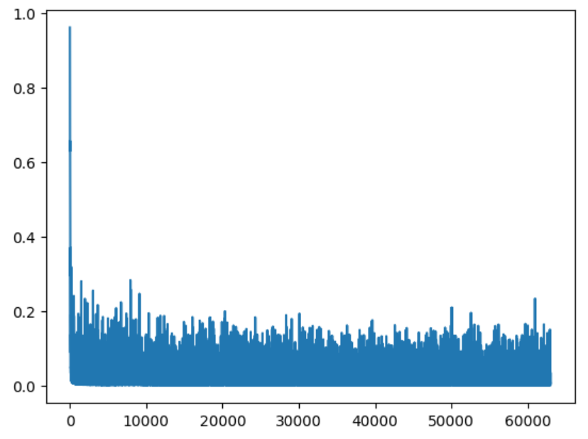
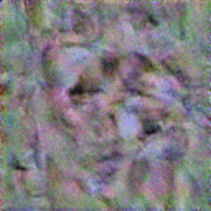

# Video generation

Сервис для создания видео-аватара как из загруженного изображения, 
так и с помощью генерации его небольшой диффузионной моделью.

* `Telegram: @Alexander437`
* `Stepik ID: 151346645`

Большинство из существующих подобных сервисов работают очень долго. 
- поэтому данный сервис предоставляет настройки, позволяющие каждому выбрать оптимальное 
для него соотношение `качество/время ожидания`

Часто хочется скорректировать речь аватара - добавить паузу или изменить темп речи
- данный сервис предоставляет пользователям возможность сделать это за счет специальных символов (сочетаний)

Было бы хорошо в одном месте генерировать и исходное изображение аватара, и видео, чтобы сразу 
проверить, как это выглядит и иметь авторские права по сравнению с правами на скачанные фото
- этот функционал также предоставляется

[Посмотрите, как сгенерированный аватар будет представлять проект)](https://youtu.be/GOgIH2UzEcw)

[Таблица с проектами](https://docs.google.com/spreadsheets/d/1md-e4VOqdVASvk1Xtra2UEt0YHYCTLu_EQ_1jJcDvKk/edit?pli=1#gid=601294132)

## Steps

### 1. Анализ существующих сервисов

[Visper](https://visper.sberdevices.ru/en)

Плюсы:
- стабильная работа и высокое качество генерации
- возможность разместить презентацию или изображение, на фоне которого будет аватар
- поддержка ru/en
- чтение pdf

Минусы:
- частично предопределенные образы аватаров
- нет настроек для генерируемого видео
- нет возможности для управления речью - скорректировать ударения, добавить паузы

[Kvint.io](https://kvint.io)

Плюсы:
- генерирует речь и отвечает на вопросы, может не требовать пользовательского ввода
- обеспечивает живой диалог
- высокое качество генерации
 
Минусы:
- предопределенные образы аватаров
- нет настроек для генерируемого видео

[Synthesia](https://www.synthesia.io/) 

Плюсы:
- стабильная работа и высокое качество генерации
- возможность разместить презентацию или изображение, на фоне которого будет аватар
- поддержка различных языков
- чтение pdf

Минусы:
- нет возможности для управления речью
- нет настроек для генерируемого видео

[D-ID](https://www.d-id.com/)
Плюсы:
- возможность создания агентов с живым диалогом
- агенты могут ориентироваться на базы знаний (RAG алгоритм)
- высокое качество генерации

Минусы:
- нет возможности для управления речью
- нет настроек для генерируемого видео

[Microsoft Lifelike](https://huggingface.co/posts/Jaward/597835329939130)
Плюсы:
- стабильная работа и высокое качество генерации
- множество настроек при генерации видео

Минусы:
- нет возможности использовать аватара на фоне презентации
- функционирует как gradio демо-версия, а не полноценный веб-сервис

### 2. Части сервиса

| Часть                               | Путь             | Подход                                                                                                                     |
|-------------------------------------|------------------|----------------------------------------------------------------------------------------------------------------------------|
| Генерация речи                      | `backend/speech` | [torchTTS (silero-models)](https://colab.research.google.com/github/snakers4/silero-models/blob/master/examples_tts.ipynb) |
| Генерация видео                     | `backend/video`  | [SadTalker](https://github.com/OpenTalker/SadTalker)                                                                       |                                                                      
| Генерация аватара (исходного кадра) | `backend/avatar` | [Diffusers](https://huggingface.co/docs/diffusers/index)                                                                   |

### 3. Функциональность, преимущества/ограничения

Данный сервис предназначен для создания видео-аватара как из загруженного изображения, 
так и с помощью генерации его диффузионной моделью.

Большинство существующих сервисов не предоставляют многих настроек пользователям. Данный сервис позволяет
выполнить тщательную настройку при:
- генерации видео (выбор `enhancer` (метод улучшения генерации лица),
режима `лицо` или `в полный рост`, способа предварительной обработки)
- генерации аудио (выбор качества (`sample rate`), возможность использования специальной разметки (
возможность пользователя определить ударения, темп, тон, паузы))

Многие настройки позволяют пользователю оптимизировать `качество / время ожидания`, чего не позволяют
большинство существующих сервисов (приходится долго ждать, даже когда хочется быстро посмотреть как все
будет выглядеть)

Кроме того, большинство существующих сервисов не предоставляют возможностей для генерации фото аватара
(исходного кадра), для этих целей приходится пользоваться функционалом других сервисов. Данный проект 
предоставляет этот функционал.

Ограничения:
- проект запускался на GPU емкостью 4GB, приходилось выбирать достаточно маленькие модели и исключить их копии,
поэтому не используется celery, за единицу времени обслуживается не более одного пользователя
- на загруженном (или сгенерированном) изображении должно быть лицо
- возможно улучшение качества генерации за счет более длительного обучения, подбора гиперпараметров (на сегодняшний день у меня не было ресурсов, чтобы это сделать)

### 4. Install

```bash
sudo apt-get install -y python3-dev libasound2-dev build-essential ffmpeg curl
pip install -r backend/requirements.txt

curl -o- https://raw.githubusercontent.com/nvm-sh/nvm/v0.39.0/install.sh | bash
source ~/.bashrc
nvm install --lts
nvm alias default 20.15.1
```

Скопировать папки с весами [weights и gfpgan](https://drive.google.com/drive/folders/1eibEb8W2Lhdh1WFNVJj3SGH06we5pHzv?usp=drive_link) и поместить их в папку `backend`

#### В режиме разработки

Запустить backend
```bash
cd backend
python main.py
```
Запустить frontend
```bash
cd frontend
npm i
npm run dev
```

Для запуска не в режиме разработки требуется:
1. Собрать frontend
```bash
cd frontend
npm run build
```
2. Использовать `gunicorn`
3. Использовать мощную видеокарту и настроить количество процессов в celery в соответствии с ее емкостью

### 5. Обучение нейронной сети для генерации исходного изображения

При запуске данного сервиса на gpu емкостью 4GB, всю gpu занимает модель генерации видео (она работает дольше всего).
Генерировать исходное изображение аватара приходится на cpu. В данном случае `Kandinsky` и `Stable Diffusion` имеют ряд недостатков:

- нет гарантии, что на изображении обязательно будет лицо (даже если попробовать придумать system prompt), без этого сгенерировать видео не удастся
- модели очень большие, почему-то они падали у меня даже на cpu

Поэтому потребовалось обучить свою модель для генерации аватаров. Использовалась небольшая диффузионная модель с Unet.

Набор данных: [CelebA](https://www.kaggle.com/datasets/jessicali9530/celeba-dataset)

Из-за ограничений gpu, размер генерируемых изображений `128x128`, а `batch_size` не более 3.

Вот как модель постепенно училась создавать аватаров):



От шума к неплохим генерациям:



### 5. Демовидео

* [test - генерация от начала до конца](https://drive.google.com/file/d/1jTX6HeOE1qI3jRII6VOi-810y963d9PW/view?usp=drive_link)
* [Сгенерированный аватар сам представляет этот проект](https://drive.google.com/file/d/1azesoppCl-otT2rUWczfCSvg38vLke4c/view?usp=drive_link)
* [result как выглядит сгенерированное видео, если его скачать](https://drive.google.com/file/d/1rtwhORd8pfIi9Qq4P3IIOIbnLHLvr619/view?usp=drive_link)